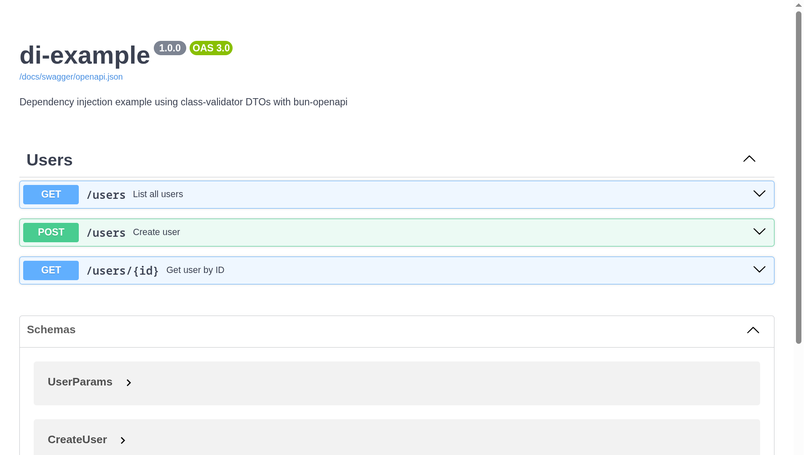
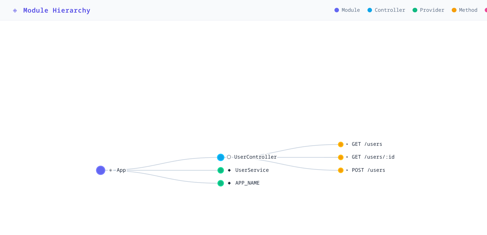
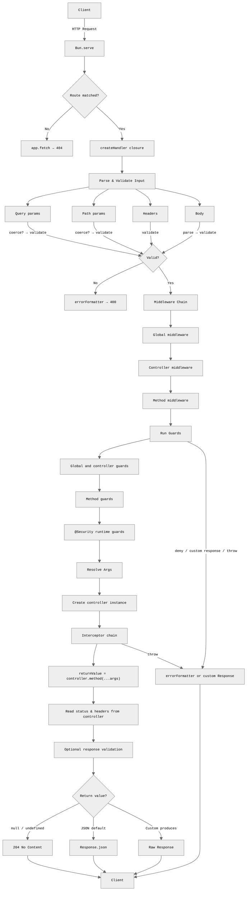
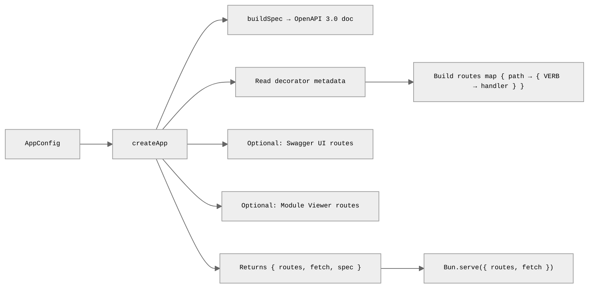

<h1 align="center">
	bun-openapi
</h1>

<p align="center">
	Decorator-driven OpenAPI 3.0 spec generation and request validation for
	<a href="https://bun.sh">Bun</a>, using TypeScript experimental decorators.
	Schema-agnostic — bring your own validation library.
</p>

<p align="center">
	<a href="./docs/index.md">Documentation</a> |
	<a href="./docs/getting-started.md">Getting started</a> |
	<a href="./docs/guides/index.md">Guides</a> |
	<a href="./docs/reference/index.md">Reference</a> |
	<a href="./docs/faq.md">FAQ</a>
</p>

## Why

Existing OpenAPI libraries for Node.js (like [typoa](https://github.com/Eywek/typoa))
rely on runtime transpilation or Express-specific middleware. This library uses
TypeScript's `experimentalDecorators` with `reflect-metadata` for a familiar
decorator model (same as NestJS) and Bun's built-in HTTP server with route-based
dispatch — providing a Bun-native experience with broad ecosystem compatibility.

## Features

- NestJS like TypeScript decorators with `reflect-metadata`
- Bun-native HTTP via `Bun.serve()` route map
- Schema-agnostic — adapters for [class-validator](#class-validator), [TypeBox](#typebox), [Zod](#zod), and [Valibot](#valibot)
- OpenAPI 3.0.3 spec generation with request validation (params, query, body, headers)
- Guards, interceptors, and optional response validation
- HTTP exceptions, error formatting, and caller context via `getCallerContext()`
- Built-in [Swagger UI](#swagger-ui) and [Module Viewer](#module-viewer) (self-contained, no CDN)
- Spec-only mode, YAML/JSON file output, and strict module import validation

| Swagger UI                                                                                                                                                                  | Module Viewer                                                                                                                                                |
| --------------------------------------------------------------------------------------------------------------------------------------------------------------------------- | ------------------------------------------------------------------------------------------------------------------------------------------------------------ |
| Auto-generated interactive API docs at `/docs/swagger/`. Explore endpoints, inspect schemas, and try requests in the browser. OpenAPI JSON at `/docs/swagger/openapi.json`. See [dependency-injection example](examples/dependency-injection/). | Visual dependency graph of your module tree at `/docs/modules/`. Shows modules, controllers, providers, and methods in an interactive force-directed layout. |
|                                                                                                                                    |                                                                                                               |

## Install

```sh
bun add bun-openapi
```

Install your preferred schema library as a peer dependency:

```sh
# class-validator (default in examples)
bun add class-validator class-transformer

# TypeBox
bun add @sinclair/typebox

# Zod
bun add zod zod-to-json-schema

# Valibot
bun add valibot @valibot/to-json-schema
```

## Examples

Runnable examples default to `class-validator` DTOs unless the adapter choice is the feature being demonstrated.

- **[basic](examples/basic/)** — CRUD API with schemas, HTTP exceptions, a global error formatter, and Swagger UI
- **[class-validator](examples/class-validator/)** — DTO-based validation and OpenAPI generation with `class-validator`
- **[complex](examples/complex/)** — Multi-module app with DI, middleware, Swagger UI, and the module viewer
- **[dependency-injection](examples/dependency-injection/)** — Constructor and token-based injection with providers plus `decorator-toolkit/*/legacy` service decorators
- **[guards](examples/guards/)** — `@UseGuards(...)`, runtime `@Security(...)` enforcement, custom guard responses, and formatted errors
- **[interceptors](examples/interceptors/)** — `@UseInterceptors(...)` for response envelopes, cached `Response` short-circuiting, and response validation
- **[logging](examples/logging/)** — `AsyncLocalStorage` request context with optional `x-user-id` and `x-session-id` headers plus automatic endpoint caller tags like `ItemController.create` across `await` boundaries
- **[modules](examples/modules/)** — Nest-style modules with exported provider sharing and private provider boundaries
- **[multi-controller](examples/multi-controller/)** — Multiple controllers, operation IDs, `@Deprecated`, `@Hidden`, and `@Produces`
- **[security](examples/security/)** — Bearer auth with `@Security(...)` plus runtime `securityGuards`

## Quick start

### Define schemas

```ts
import {
	IsEmail,
	IsString,
	MinLength,
} from "class-validator";

export class User {
	@IsString()
	id!: string;

	@IsString()
	@MinLength(1)
	name!: string;

	@IsEmail()
	email!: string;
}

export class CreateUser {
	@IsString()
	@MinLength(1)
	name!: string;

	@IsEmail()
	email!: string;
}

export class UserParams {
	@IsString()
	id!: string;
}
```

### Define a controller

```ts
import {
	Body,
	Controller,
	Get,
	Param,
	Post,
	Returns,
	Route,
	Summary,
	Tags,
} from "bun-openapi";
import {
	CreateUser,
	User,
	UserParams,
} from "./schemas.js";

@Route("/users")
@Tags("Users")
class UserController extends Controller {
	@Get()
	@Summary("List users")
	@Returns(200, [User], "List of users")
	list() {
		return [];
	}

	@Get("/:id")
	@Summary("Get user by ID")
	@Returns(200, User, "The user")
	getById(@Param(UserParams) params: UserParams) {
		return { id: params.id, name: "Alice", email: "alice@example.com" };
	}

	@Post()
	@Summary("Create a user")
	@Returns(201, User, "Created user")
	create(@Body(CreateUser) body: CreateUser) {
		this.setStatus(201);
		return {
			id: crypto.randomUUID(),
			name: body.name,
			email: body.email,
		};
	}
}

export { UserController };
```

### Start the server

```ts
import { createApp } from "bun-openapi";
import { classValidator } from "bun-openapi/adapters/class-validator";
import { UserController } from "./controller.js";

const app = createApp({
	schema: classValidator(),
	controllers: [UserController],
	swagger: true,
	openapi: {
		filePath: "./openapi.yaml",
		service: {
			name: "my-api",
			version: "1.0.0",
			description: "A simple CRUD API",
		},
	},
});

Bun.serve({
	port: 3000,
	routes: {
		...app.routes,
	},
	fetch: app.fetch,
});
```

The OpenAPI spec is available at `app.spec` and Swagger UI at `/docs/swagger`.
When `filePath` is set, the spec is written to disk on startup — `.yaml` / `.yml`
extensions produce YAML output, everything else produces JSON.

## Request Binding

Controller methods receive request data through parameter decorators. Each
decorator binds the value for one handler argument and can also carry the
validation schema when needed:

```ts
@Get("/:id")
getById(@Param(UserParams) params: UserParams) {
	return { id: params.id };
}

@Get("/:id/search")
search(
	@Param("id") id: number,
	@Query("page") page?: number,
	@Query("search") search?: string,
) {
	return { id, page, search };
}

@Post()
create(@Body(CreateUser) body: CreateUser) {
	return { name: body.name };
}
```

| Decorator            | Meaning                                                               |
| -------------------- | --------------------------------------------------------------------- |
| `@Param(schema)`     | Validate and bind the whole path params object                        |
| `@Query(schema)`     | Validate and bind the whole query object                              |
| `@Header(schema)`    | Validate and bind the whole headers object                            |
| `@Body(schema)`      | Validate and bind the request body                                    |
| `@Param("id")`       | Bind one path param and coerce it from the reflected primitive type   |
| `@Query("page")`     | Bind one query param and coerce it from the reflected primitive type  |
| `@Header("x-token")` | Bind one header value and coerce it from the reflected primitive type |
| `@Request()`         | Bind the raw Bun `Request` object                                     |

Notes:

- Scalar bindings without schemas require explicit source names like `@Param("id")` or `@Query("page")`.
- Fully implicit query binding from handler parameter names is not supported at runtime.
- `@Body()` without a schema binds the parsed body without adapter validation.

## Exceptions

Controllers can throw HTTP exceptions instead of manually combining `setStatus()` with error return objects:

```ts
import {
	Controller,
	Get,
	NotFoundException,
	Route,
} from "bun-openapi";

@Route("/users")
class UserController extends Controller {
	@Get(":id")
	getById() {
		throw new NotFoundException("User not found");
	}
}
```

Available built-ins:

- `HttpException`
- `BadRequestException`
- `UnauthorizedException`
- `ForbiddenException`
- `NotFoundException`

Validation failures from `@Param`, `@Query`, `@Header`, and `@Body` also flow through the same error pipeline.

See `examples/basic/` for a runnable CRUD example that uses `NotFoundException` and a global `errorFormatter`.

To standardize error responses globally, provide `errorFormatter` in `createApp()`:

```ts
const app = createApp({
	schema: classValidator(),
	controllers: [UserController],
	errorFormatter: (_error, context) => ({
		status: context.status,
		body: {
			ok: false,
			error: context.body,
		},
	}),
});
```

## Guards

Use `@UseGuards(...)` to run authorization or access checks after request parsing and before the controller method runs:

```ts
import {
	type CanActivate,
	type CanActivateSecurity,
	Controller,
	Get,
	Injectable,
	Route,
	UseGuards,
} from "bun-openapi";

@Injectable()
class RequireAdminGuard implements CanActivate {
	canActivate({ request }: { request: Request; }) {
		return request.headers.get("x-role") === "admin";
	}
}

@Route("/admin")
@UseGuards(RequireAdminGuard)
class AdminController extends Controller {
	@Get("/stats")
	handle() {
		return { ok: true };
	}
}
```

Guard return values:

- `true` or `undefined` allows the request.
- `false` denies the request with `403 Forbidden`.
- `Response` short-circuits the pipeline with a custom response.
- Throwing an exception uses the same error formatter pipeline as controllers.

Routes decorated with `@Security(...)` can also be enforced at runtime with `securityGuards`:

```ts
@Injectable()
class BearerAuthGuard implements CanActivateSecurity {
	canActivate({ request }: { request: Request; }) {
		return request.headers.get("authorization") === "Bearer demo-token";
	}
}

const app = createApp({
	schema: classValidator(),
	controllers: [AdminController],
	securityGuards: {
		bearerAuth: BearerAuthGuard,
	},
});
```

If a configured security guard returns `false`, the request is rejected with `401 Unauthorized`.

See `examples/guards/` for a focused runnable example that combines `@UseGuards(...)`, custom guard responses, `ForbiddenException`, and runtime `securityGuards`.

## Interceptors

Use `@UseInterceptors(...)` to wrap handler execution, transform successful return values, or short-circuit the handler entirely.

```ts
import {
	Controller,
	Get,
	Injectable,
	type Interceptor,
	type InterceptorContext,
	Route,
	UseInterceptors,
} from "bun-openapi";

@Injectable()
class EnvelopeInterceptor implements Interceptor {
	async intercept({ className, methodName, handlerName }: InterceptorContext, next: () => Promise<unknown>) {
		return {
			data: await next(),
			meta: { className, methodName, handlerName },
		};
	}
}

@Route("/reports")
class ReportsController extends Controller {
	@Get("/summary")
	@UseInterceptors(EnvelopeInterceptor)
	handle() {
		return { ok: true };
	}
}
```

Interceptor behavior:

- Interceptors run after guards pass and around the actual controller method invocation.
- `InterceptorContext` includes `className` and `methodName`, and the same endpoint metadata is also available to request-scoped services through `getCallerContext()`.
- `await next()` executes the next interceptor or the handler.
- Returning a plain value transforms the handler output before serialization.
- Returning a `Response` short-circuits response serialization entirely.
- Throwing an error uses the same error formatter pipeline as controllers.

See `examples/interceptors/` for a focused example that combines envelope transformation, `Response` short-circuiting, and response validation.

## Response validation

If you want runtime contract enforcement for successful handler output, enable `validateResponse` in `createApp()`.
When enabled, bun-openapi validates the returned payload against the declared `@Returns(status, schema)` schema that matches the final status code.

```ts
const app = createApp({
	schema: classValidator(),
	controllers: [UserController],
	validateResponse: true,
});
```

You can override that global default per controller or per method with `@ValidateResponse(...)`:

```ts
@Route("/users")
@ValidateResponse()
class UserController extends Controller {
	@Get()
	@Returns(200, User)
	list() {
		return [];
	}

	@Get("/legacy")
	@ValidateResponse(false)
	legacy() {
		return { ok: "unchecked" };
	}
}
```

Behavior:

- Validation runs after guards and controller execution, but before the response is serialized.
- Only declared response schemas for the final status code are enforced.
- Method-level `@ValidateResponse(...)` overrides controller-level settings, which override the global `createApp({ validateResponse })` default.
- If validation fails, the request goes through the same error pipeline and returns a `500` unless your `errorFormatter` changes it.

## Decorators

### Class decorators

| Decorator                     | Description                                  |
| ----------------------------- | -------------------------------------------- |
| `@Route(prefix)`              | Base path for all methods in the controller  |
| `@Tags(...names)`             | OpenAPI tags for all methods                 |
| `@Security(scheme, scopes?)`  | Security requirement for all methods         |
| `@UseGuards(...guards)`       | Attach guards to all methods                 |
| `@UseInterceptors(...fns)`    | Attach interceptors to all methods           |
| `@ValidateResponse(enabled?)` | Override response validation for all methods |
| `@Middleware(fn)`             | Attach middleware to all methods             |

### Method decorators

| Decorator                        | Description                                 |
| -------------------------------- | ------------------------------------------- |
| `@Get(path?)`                    | HTTP GET                                    |
| `@Post(path?)`                   | HTTP POST                                   |
| `@Put(path?)`                    | HTTP PUT                                    |
| `@Patch(path?)`                  | HTTP PATCH                                  |
| `@Delete(path?)`                 | HTTP DELETE                                 |
| `@Returns(code, schema?, desc?)` | Response definition                         |
| `@Produces(contentType)`         | Response content type                       |
| `@Summary(text)`                 | Operation summary                           |
| `@Description(text)`             | Operation description                       |
| `@OperationId(id)`               | Explicit operation ID                       |
| `@Deprecated()`                  | Mark as deprecated                          |
| `@Hidden()`                      | Exclude from OpenAPI spec                   |
| `@UseGuards(...guards)`          | Attach guards to one method                 |
| `@UseInterceptors(...fns)`       | Attach interceptors to one method           |
| `@ValidateResponse(enabled?)`    | Override response validation for one method |

### Parameter decorators

| Decorator                     | Description                     |
| ----------------------------- | ------------------------------- |
| `@Param(schema or key)`       | Path schema or scalar binding   |
| `@Query(schema or key)`       | Query schema or scalar binding  |
| `@Header(schema or key)`      | Header schema or scalar binding |
| `@Body(schema, contentType?)` | Request body schema             |
| `@Request()`                  | Raw request binding             |

## Schema adapters

The library is decoupled from any specific schema library through the
`SchemaAdapter` interface:

```ts
interface SchemaAdapter<TSchema = unknown> {
	toJsonSchema(schema: TSchema, schemas: Map<string, Record<string, unknown>>): Record<string, unknown>;
	validate(schema: TSchema, data: unknown): ValidationResult;
	coerce?(schema: TSchema, data: unknown): unknown;
}
```

### class-validator

```ts
import { classValidator } from "bun-openapi/adapters/class-validator";

const app = createApp({
	schema: classValidator(),
	controllers: [...],
});
```

### TypeBox

```ts
import { typebox } from "bun-openapi/adapters/typebox";

const app = createApp({
	schema: typebox(),
	controllers: [...],
});
```

### Zod

```ts
import { zod } from "bun-openapi/adapters/zod";

const app = createApp({
	schema: zod(),
	controllers: [...],
});
```

### Valibot

```ts
import { valibot } from "bun-openapi/adapters/valibot";

const app = createApp({
	schema: valibot(),
	controllers: [...],
});
```

## Swagger UI

Enable the built-in Swagger UI by setting `swagger: true` or passing a config
object:

```ts
const app = createApp({
	schema: classValidator(),
	controllers: [...],
	swagger: true,
	// or with a custom path:
	// swagger: { path: "/swagger" },
});
```

The default path is `/docs/swagger`. The UI is served as a self-contained HTML page
built at runtime using `Bun.build({ target: "browser", compile: true })` — no
external CDN requests. The spec JSON is served at `{path}/openapi.json`.

Requires `swagger-ui-dist` as a peer dependency:

```sh
bun add swagger-ui-dist
```

## Module Viewer

Enable the built-in module hierarchy viewer by setting `moduleViewer: true` or
passing a config object:

```ts
const app = createApp({
	schema: classValidator(),
	imports: [AppModule],
	moduleViewer: true,
	// or with a custom path:
	// moduleViewer: { path: "/modules" },
	// or with SVG configuration:
	// moduleViewer: { path: "/modules", svgPath: "/modules/graph.svg" },
});
```

The viewer is registered whenever there is something to visualize: imported
modules, direct app-level controllers, direct providers, or a mix of those.
With a single imported module and no direct app-level entries, the viewer root
is that module. Otherwise the viewer wraps the graph in an `App` or `Root`
node. The default path is `/docs/modules`. The HTML is served as a
self-contained page built at runtime using `Bun.build({ target: "browser",
compile: true })`, and the raw tree data is also available at `{path}/tree.json`.
A static SVG rendering is served at `{path}/tree.svg` by default, or at
`svgPath` when configured. Set `svgPath: false` to disable that route.

Imported modules are validated eagerly at startup. `createApp({ imports })`
throws if a module exports a provider token it does not declare or re-export,
it throws with the full module path when circular imports are found, and only
providers listed in `exports` are visible outside the module that defines them.

When either Swagger UI or the module viewer is enabled, `/docs/` serves a small
index page with links to the configured documentation endpoints.

The complex example uses this mode:

```sh
bun run examples/complex/server.ts
```

Then open `/docs/modules/` to inspect modules, controllers, providers, methods,
and middleware nodes, or `/docs/modules/tree.svg` for a static SVG export.

## Spec-only mode

Generate an OpenAPI spec without starting a server — useful for CI pipelines,
documentation builds, or client SDK generation:

```ts
import {
	buildSpec,
	Controller,
	Get,
	Returns,
	Route,
} from "bun-openapi";
import { classValidator } from "bun-openapi/adapters/class-validator";
import { IsString } from "class-validator";

class Pet {
	@IsString()
	name!: string;
}

@Route("/pets")
class PetController extends Controller {
	@Get()
	@Returns(200, [Pet])
	list() {
		return [];
	}
}

const spec = buildSpec([PetController], classValidator(), {
	service: { name: "petstore", version: "1.0.0" },
});

// Write as JSON
await Bun.write("openapi.json", JSON.stringify(spec, null, "\t"));

// Or as YAML
await Bun.write("openapi.yaml", Bun.YAML.stringify(spec, null, 2));
```

## Request flow



### Startup



## Related

- [typoa](https://github.com/Eywek/typoa) — Express-based OpenAPI generation with legacy decorators
- [Bun HTTP API](https://bun.sh/docs/api/http) — Bun's built-in HTTP server documentation
- [TypeScript Decorators](https://www.typescriptlang.org/docs/handbook/decorators.html) — TypeScript experimental decorators documentation
- [TypeBox](https://github.com/sinclairzx81/typebox) — JSON Schema type builder
- [OpenAPI 3.0.3](https://spec.openapis.org/oas/v3.0.3) — OpenAPI specification
